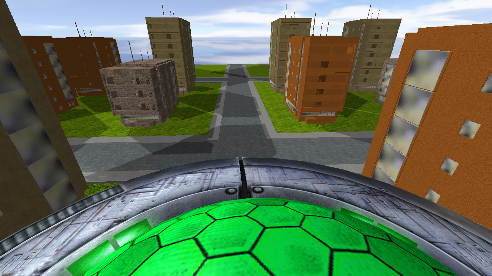
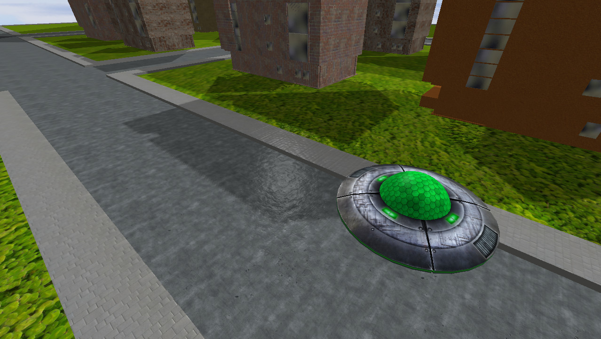

# Flight simulator

Coursework for computer graphics subject at PUT - game written in C++ with OpenGL. It allows player to fly around the city in an UFO.

Project includes:
- chunks system to generate terrain
- models loading with assimp
- camera view switching (first-person, third-person, free camera)
- ufo control system involving inertia
- Blinn–Phong lighting model
- shadow mapping
- parallel collision detection

